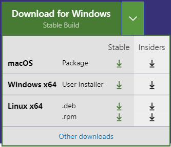

I like certain tools, such as **Visual Studio *Code***.

## VS Code

- Download VS Code - 

----

## Videos

### Should You Learn C# in 2019?

<iframe width="560" height="315" src="https://www.youtube.com/embed/ZUgNy-okDQ4" frameborder="0" allow="accelerometer; autoplay; encrypted-media; gyroscope; picture-in-picture" allowfullscreen></iframe>

### The 1 coding project idea guaranteed to get you a Software Development job

<iframe width="560" height="315" src="https://www.youtube.com/embed/oC483DTjRXU" frameborder="0" allow="accelerometer; autoplay; encrypted-media; gyroscope; picture-in-picture" allowfullscreen></iframe>