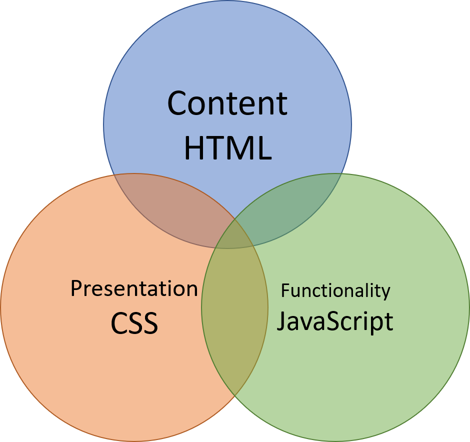
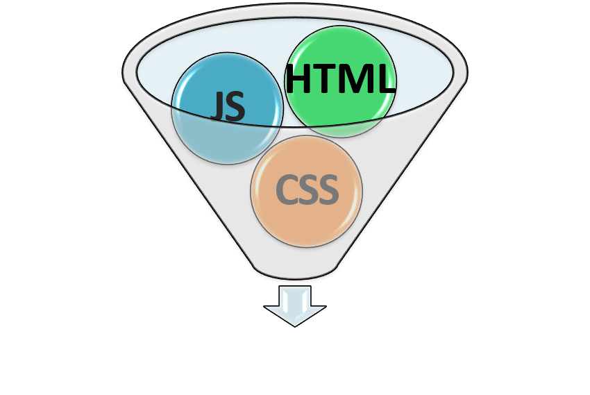

# Software is a Three-Legged Stool

Every software application is made up of three main parts: Content, Presentation, and Functionality. **Content** is all about the information used or presented in the app. **Presentation** is area where we're concerned with the "look and feel" of the app. The "working parts" of an application represents the **Functionality**.

In a web application, these three parts are very distinct in their language (*HTML* for content, *CSS* for presentation, and *JavaScript* for functionality). Nevertheless, these languages live their lives intertwined with each other like triplets from birth. Here, I'll take a brief look at the history of their relationship and then offer some "*better* practices" in keeping those relationships "healthy." 

## Evolving Practices

In the very early days of the web, creating HTML content was the primary focus of web development. CSS and JavaScript were enhancements on top of HTML, and interspering them directly into your HTML was considered acceptable. It was a simpler time. Oh, how times have changed!

Today, the CSS and JavaScript in a website have taken on a much greater role. It's more common to speak of web *"apps"* instead of web *"sites."* It wasn't long until we began putting our CSS and JavaScript into separate files. It made it much easier to manage those part of the codebase. If you were tempted to use inline CSS or JavaScript directly in your HTML, your colleagues would frown on you and remind you of "best practices."

"Tight coupling" makes for bad design, because changes in either area can potentially "break" the other areas. 

"Loose coupling" between the areas of Content, Presentation, and Functionality makes for a flexible design that is easy to maintain.

| Tight Coupling | Loose Coupling |
|:--------------:|:--------------:|
|  |  |

This is not to say that content, presentation and functionality have no reference to each other. It's just that we want the connections between them to be ["unobtrusive"](https://dictionary.cambridge.org/dictionary/english/unobtrusive). In the case of web pages, it's the browser's job to bring together HTML, CSS and JavaScript files; this happens in the rendering process for the page.

